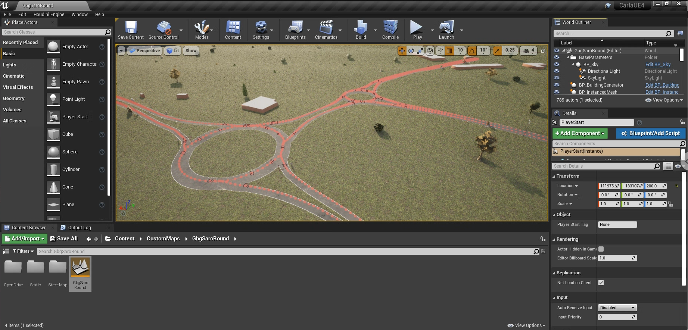
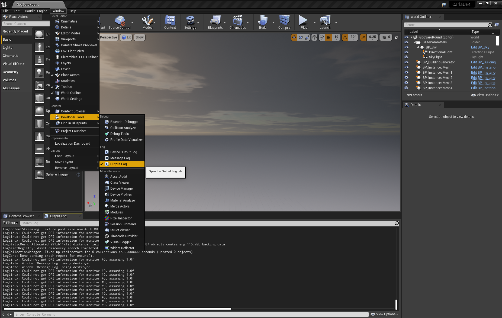
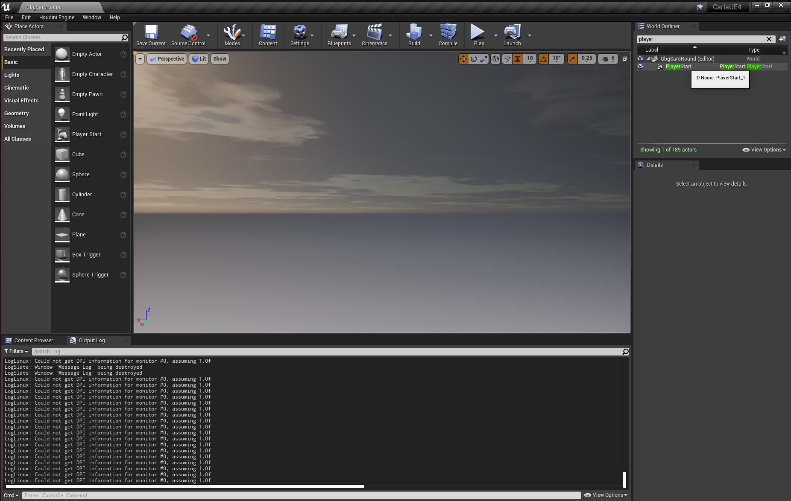
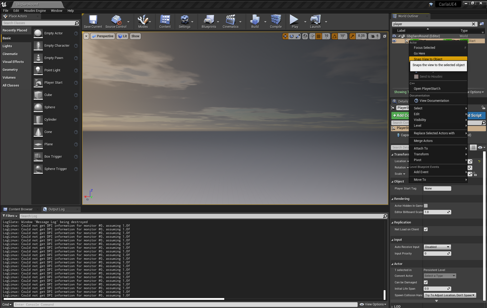

# CARLA 0.9.15 Digital Twin

A source patch for **CARLA 0.9.15** that extends CARLA's Unreal Engine map-generation workflow for creating a single-level digital twin from paired **OpenStreetMap (`.osm`)** and **OpenDRIVE (`.xodr`)** files, and extends the CARLA Python API with a simulation runner that can record camera footage of scripted ego and NPC vehicle drives.

The patch was developed and tested with CARLA 0.9.15, Unreal Engine 4.26, and Ubuntu 22.04. It modifies CARLA, LibCarla, CarlaTools, the bundled StreetMap plugin, and selected build and navigation components.



*Example digital twin generated in the CARLA Unreal Editor from paired OSM and XODR inputs.*

## What the patch adds

- Import of local OSM and XODR files through `CarlaTools.GenerateMap`.
- Single-level digital twin generation at a chosen Unreal content path.
- Alignment of OSM-derived environmental content with the OpenDRIVE road network.
- Import of OSM buildings, forest areas, and individual trees through the customized StreetMap plugin.
- Improved road surfaces, terrain integration, lane markings, roundabout markings, and bidirectional center lines.
- Selectable bidirectional center-line styles.
- More deterministic multithreaded road and junction mesh generation.
- Improved tree placement near road edges and junction approaches.
- Extended `automatic_control.py` with reproducible seeds, explicit spawn and target transforms, NPC vehicle agents, simulation time limits, multiple camera views, and MP4 recording via ffmpeg.
- Selected CARLA Python navigation changes used to test generated maps.

> [!NOTE]
> The patch contains more than the minimum digital-twin generator changes. Review the changes under `PythonAPI/` before using the patch in a production or research branch.

---

# Part 1: Generating a Digital Twin

## Prerequisites

- Ubuntu 22.04
- Unreal Engine 4.26 configured for CARLA, following the official [CARLA 0.9.15 Linux build guide](https://carla.readthedocs.io/en/0.9.15/build_linux/).
- CARLA content assets
- A matching `.osm` and `.xodr` pair for the same geographic area

## 1. Clone the CARLA source

Clone CARLA and check out that commit:

```bash
git clone https://github.com/carla-simulator/carla.git
cd carla
git checkout --detach d7b45c1e159e6d13296f7a3a4e8b13e6c2d62c18
```


## 2. Update CARLA content

Before applying the digital-twin source patch, follow the **Get assets** or **Download the CARLA content** section of the official [CARLA 0.9.15 Linux build guide](https://carla.readthedocs.io/en/0.9.15/build_linux/).

At the time of writing, the default CARLA content URL used by `Update.sh` is not serving the CARLA 0.9.15 content archive. Apply the small content URL workaround patch first:

```bash
git apply --whitespace=error-all \
  /path/to/carla-0.9.15-content-url.patch
```

Then run:

```bash
./Update.sh
```

## 3. Build LibCarla

Build LibCarla once before applying the patch:

```bash
make LibCarla
```

To retain a build log:

```bash
make LibCarla 2>&1 | tee build.log
```

## 4. Apply the patch

After CARLA content has been downloaded and LibCarla has built successfully, apply the digital-twin source patch from the CARLA repository root:

```bash
git apply --whitespace=error-all \
  /path/to/carla-0.9.15-digital-twin.patch
```

### Existing `Streetmap` symlink

The patch includes this case-sensitive symbolic link:

```text
Unreal/CarlaUE4/Plugins/Streetmap -> StreetMap
```

If `git apply` reports:

```text
error: Unreal/CarlaUE4/Plugins/Streetmap: already exists in working directory
```
remove only the link and apply the patch again:

```bash
rm Unreal/CarlaUE4/Plugins/Streetmap

git apply --check --whitespace=error-all \
  /path/to/carla-0.9.15-digital-twin.patch

git apply --whitespace=error-all \
  /path/to/carla-0.9.15-digital-twin.patch
```

## 5. Launch patched CARLA Editor

Build and launch the patched editor with:

```bash
make launch ARGS="--editor-flags -norelativemousemode"
```

The `-norelativemousemode` option is useful on Linux machines accessed through remote desktop software because it can avoid mouse capture and cursor movement problems in Unreal Editor.

For a standard local launch, use:

```bash
make launch
```

To retain a build log:

```bash
make launch 2>&1 | tee build.log
```

If the patched build reports stale Unreal build output or generated-file errors, clear the previous editor build output first:

```bash
rm -rf Unreal/CarlaUE4/Intermediate
rm -rf Unreal/CarlaUE4/Binaries
rm -rf Unreal/CarlaUE4/Saved

find Unreal/CarlaUE4/Plugins \
  -mindepth 2 -maxdepth 2 \
  \( -name Intermediate -o -name Binaries \) \
  -exec rm -rf {} +
```

Then rebuild:

```bash
make launch 2>&1 | tee build.log
```

## 6. Prepare the OSM and XODR inputs

The OSM and XODR files must describe the same geographic area and use compatible georeferencing. Misaligned inputs can place roads, buildings, terrain, forests, or trees at incorrect offsets.

- Use OSM for buildings, forests, individual trees, and other environmental features.
- Use XODR for authoritative road topology, lanes, junctions, and geometry.
- With both files provided, `-PreferXODRWhenBothProvided=true` uses XODR for the road network while retaining OSM-derived environmental features.

### Generate and edit XODR with OpenRoadEditor

This workflow used [das-rise/open-road-editor](https://github.com/das-rise/open-road-editor) to edit the OSM road network and generate the corresponding `.xodr` file supplied to the CARLA commandlet.

A typical workflow is:

1. Clone and install OpenRoadEditor by following its repository instructions.
2. Load the source `.osm` file.
3. Inspect and edit the OSM road network.
4. Generate or refresh the OpenDRIVE representation.
5. Verify lane geometry, road connectivity, junctions, roundabouts, and georeferencing.
6. Retain matching files such as:

   ```text
   MyDigitalTwin.osm
   MyDigitalTwin.xodr
   ```

7. Pass both absolute file paths to `CarlaTools.GenerateMap`.

If the OSM road network is changed, regenerate the XODR file before running CARLA map generation again.

## 7. Generate a digital twin

### Step 1: Open CARLA Editor

Launch the editor and wait until the CARLA project is fully loaded.

### Step 2: Open the Unreal Output Log

In Unreal Editor, open:

```text
Window > Developer Tools > Output Log
```



The console command field appears at the bottom of the Output Log next to the `Cmd` label.

### Step 3: Execute the map-generation command

General form:

```text
CarlaTools.GenerateMap -LocalOSMFilePath="/path/to/MyDigitalTwin.osm" -LocalXODRFilePath="/path/to/MyDigitalTwin.xodr" -PreferXODRWhenBothProvided=true -GenerateSingleLevelMap=true -SingleLevelBoundsPadding=1500 -BaseLevelName="/Game/CustomMaps/MyDigitalTwin" -ForceOverwrite=true -RedrawLaneMarkings=false -TerrainRoadBlendDistance=6 -TerrainRoadClearance=0.02 -BidirectionalCenterLineMarking=WhiteBroken
```

Example:

```text
CarlaTools.GenerateMap -LocalOSMFilePath="$HOME/open-road-editor/examples/GbgSaroRound/GbgSaroRound.osm" -LocalXODRFilePath="$HOME/open-road-editor/examples/GbgSaroRound/GbgSaroRound.xodr" -PreferXODRWhenBothProvided=true -GenerateSingleLevelMap=true -SingleLevelBoundsPadding=1500 -BaseLevelName="/Game/CustomMaps/GbgSaroRound" -ForceOverwrite=true -RedrawLaneMarkings=false -TerrainRoadBlendDistance=6 -TerrainRoadClearance=0.02 -BidirectionalCenterLineMarking=WhiteBroken
```

Every option must have a leading hyphen. For example:

```text
-RedrawLaneMarkings=false
-BidirectionalCenterLineMarking=WhiteBroken
```

## Generation options

### Input files

- `-LocalOSMFilePath="..."`: Absolute path to the OpenStreetMap file.
- `-LocalXODRFilePath="..."`: Absolute path to the OpenDRIVE file.

### Generation settings

- `-PreferXODRWhenBothProvided=true`: Uses OpenDRIVE geometry when both OSM and XODR are available.
- `-GenerateSingleLevelMap=true`: Generates the map in one Unreal Engine level.
- `-SingleLevelBoundsPadding=1500`: Adds padding around the generated map boundary.
- `-BaseLevelName="/Game/CustomMaps/Name"`: Sets the Unreal package path for the generated map.
- `-ForceOverwrite=true`: Replaces previously generated content at the target path.

### Road and terrain settings

- `-RedrawLaneMarkings=false`: Preserves the generated or source-driven lane-marking workflow instead of running a later redraw pass.
- `-TerrainRoadBlendDistance=6`: Controls blending between roads and surrounding terrain.
- `-TerrainRoadClearance=0.02`: Sets vertical clearance between road surfaces and terrain.
- `-BidirectionalCenterLineMarking=WhiteBroken`: Creates broken white center lines on supported bidirectional roads.

Supported center-line values include:

```text
None
YellowSolid
WhiteBroken
```

## 8. Open and inspect the generated map

The generated assets are stored under the package path supplied through `-BaseLevelName`. For the example command, the path is:

```text
/Game/CustomMaps/GbgSaroRound
```

Open the generated map in the Content Browser.

If the digital twin is not visible in the viewport, locate the `PlayerStart` actor.

First, type `player` in the **World Outliner** search field:



Right-click `PlayerStart` and select **Snap View to Object**:



The editor viewport should move to the generated area.

---

# Part 2: Running Simulations on the Digital Twin

The patch extends `PythonAPI/examples/automatic_control.py` with reproducible seeds, explicit ego spawn and target locations, NPC vehicle agents, simulation time limits, multiple camera views, and MP4 recording. This section covers environment setup and the full argument reference.

## Prerequisites

- A running CARLA server with the generated digital twin map loaded.
- Python 3.10 (recommended) or Python 3.8.
- `ffmpeg` installed and on `PATH` (required for `--record`).

## 1. Create a Python virtual environment

From the CARLA repository root:

```bash
python3 -m venv carla-venv
source carla-venv/bin/activate
```

## 2. Install dependencies

Install requirements from the two relevant packages, then install the CARLA Python wheel from the build output:

```bash
pip install -r PythonAPI/carla/requirements.txt
pip install -r PythonAPI/examples/requirements.txt
pip install PythonAPI/carla/dist/carla-*.whl
```

The wheel file is built as part of the CARLA build process. If the `dist/` directory is empty, run `make PythonAPI` from the CARLA repository root first.

## 3. Run a simulation

Start the CARLA server and load the target map, then run `automatic_control.py` from the repository root:

```bash
python PythonAPI/examples/automatic_control.py \
  --seed 3224900379 \
  --sync \
  --host 127.0.0.1 \
  --port 2000 \
  --res 1280x720 \
  --filter vehicle.* \
  --generation 2 \
  -a Behavior \
  -b cautious \
  --lateral-yield 5.0 \
  --spawn-transform "142293.9, -116051.6, 50.0, 18.9" \
  --target-transform "148882.9, -110524.5, 50.0, 94.0" \
  --num-npcs 20 \
  --npc-agent Behavior \
  --npc-behavior cautious \
  --npc-spacing 25.0 \
  --max-duration 30.0 \
  --camera 3 \
  --no-hud \
  --record /home/avula/Videos/drive1.mp4 \
  --record-size 1920x1080 \
  --record-cameras 1 3
```

After the simulation ends, a `_details.txt` file is written alongside the recording with the full argument list and a reproduce command.

The command above records cameras 1 (dashcam) and 3 (overhead) simultaneously, producing `drive1_dashcam.mp4` and `drive1_overhead.mp4`. The overhead view of that example run is shown below.

<video src="https://github.com/user-attachments/assets/d7e74708-97b5-4455-9468-5f360566d710" controls width="100%"></video>

## Argument reference

### Connection

| Argument | Default | Description |
|---|---|---|
| `--host H` | `127.0.0.1` | IP address of the CARLA server. |
| `--port P` / `-p P` | `2000` | TCP port of the CARLA server. |
| `--sync` | off | Enable synchronous simulation mode. Recommended for deterministic recordings. |

### Display

| Argument | Default | Description |
|---|---|---|
| `--res WIDTHxHEIGHT` | `1280x720` | pygame window resolution. |
| `--camera N` | `1` | Initial camera index (see table below). |
| `--no-hud` | off | Hide the on-screen HUD on startup. Toggle with `H` during the run. |

Camera indices:

| Index | Name | Mount |
|---|---|---|
| `0` | chase | Behind and above the vehicle (SpringArm) |
| `1` | dashcam | Front hood (Rigid) |
| `2` | front-side | Front angled (SpringArm) |
| `3` | overhead | Top-down (SpringArm) |
| `4` | rear-side | Rear angled (Rigid) |

### Actor filter

| Argument | Default | Description |
|---|---|---|
| `--filter PATTERN` | `vehicle.*` | Blueprint filter for spawning the ego vehicle. |
| `--generation G` | `2` | Restrict to a CARLA actor generation (`1`, `2`, or `All`). |

### Ego agent

| Argument | Default | Description |
|---|---|---|
| `-a` / `--agent` | `Behavior` | Agent type: `Behavior`, `Basic`, or `Constant`. |
| `-b` / `--behavior` | `normal` | Behavior profile: `cautious`, `normal`, or `aggressive`. |
| `--lateral-yield M` | `15.0` | Lateral yield zone width in metres used at roundabout entries. Lower values make the ego enter roundabouts more readily. |

### Spawn and destination

All coordinates are in Unreal Engine centimetres. Yaw is in degrees.

| Argument | Default | Description |
|---|---|---|
| `--spawn-point N` | random | Spawn the ego at authored spawn-point index `N`. |
| `--spawn-transform "X,Y,Z,YAW"` | — | Spawn the ego at an explicit world transform. Overrides `--spawn-point`. |
| `--target-spawn-point N` | random | Set the initial destination to authored spawn-point index `N`. |
| `--target-transform "X,Y,Z,YAW"` | — | Set the initial destination to an explicit world transform. Overrides `--target-spawn-point`. |

When `--target-transform` or `--target-spawn-point` is set and `--max-duration` is not set, the simulation stops once the ego reaches the target. When `--max-duration` is also set, the ego continues roaming after reaching the target until the time limit expires.

### NPC vehicles

| Argument | Default | Description |
|---|---|---|
| `--num-npcs N` | `0` | Number of NPC vehicles to spawn. |
| `--npc-agent` | `Basic` | Agent type for NPC vehicles: `Behavior`, `Basic`, or `Constant`. |
| `--npc-behavior` | `normal` | Behavior profile for NPC vehicles: `cautious`, `normal`, or `aggressive`. |
| `--npc-spacing M` | `15.0` | Minimum distance in metres between any two NPC vehicles, and between each NPC and the ego, at spawn time. |

### Simulation control

| Argument | Default | Description |
|---|---|---|
| `--seed S` / `-s S` | random | Integer seed for the random number generator. Using the same seed with the same arguments reproduces the same vehicle selection, spawn positions, and NPC placement. |
| `--max-duration S` | `30.0` if no target, else unlimited | Maximum simulation time in seconds. |

### Recording

Recording requires `ffmpeg` to be installed and available on `PATH`. Video is encoded with H.264 at 20 fps and CRF 18.

| Argument | Default | Description |
|---|---|---|
| `--record OUTPUT.mp4` | off | Save a clean camera recording (no HUD overlay) to this MP4 path. |
| `--record-size WxH` | window size | Resolution of the recorded video, e.g. `1920x1080`. Independent of the pygame window resolution. |
| `--record-cameras ID [ID ...]` | — | Record multiple camera views simultaneously. Each camera is saved to a separate file with a name suffix, e.g. `drive1_dashcam.mp4` and `drive1_overhead.mp4`. |

When `--record-cameras` lists more than one ID, or when any ID is specified with `--record-cameras`, the output filename is always suffixed with the camera name regardless of how many cameras are selected. The camera name mapping is:

| ID | Suffix |
|---|---|
| `0` | `_chase` |
| `1` | `_dashcam` |
| `2` | `_frontside` |
| `3` | `_overhead` |
| `4` | `_rearside` |

### Miscellaneous

| Argument | Default | Description |
|---|---|---|
| `-v` / `--verbose` | off | Print debug information. |

---

## Acknowledgements

- [CARLA Simulator](https://carla.org/)
- [CARLA 0.9.15 Linux build documentation](https://carla.readthedocs.io/en/0.9.15/build_linux/)
- [das-rise/open-road-editor](https://github.com/das-rise/open-road-editor)
- Unreal Engine
- OpenStreetMap contributors
- OpenDRIVE ecosystem and map-authoring tools
- StreetMap plugin contributors
